# Sistema de Reserva de Salas — FMUSP

Sistema para alunos, docentes e funcionários da Faculdade de Medicina da USP
solicitarem salas, e para o SAD (Serviço de Apoio Didático) analisar cada pedido, alocar a sala mais
adequada e aprovar ou rejeitar — com avisos por e-mail em cada etapa.

**React · TypeScript · Tailwind CSS v4 · Node.js/Express · Prisma · PostgreSQL**

<picture>
  <source media="(prefers-color-scheme: dark)" srcset="docs/screenshots/admin-analise-escuro.png">
  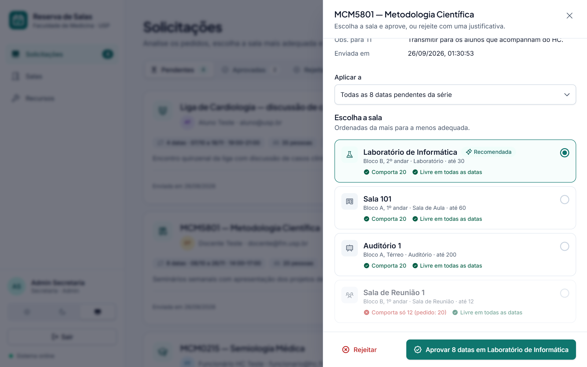
</picture>

## Telas

| | |
|---|---|
| 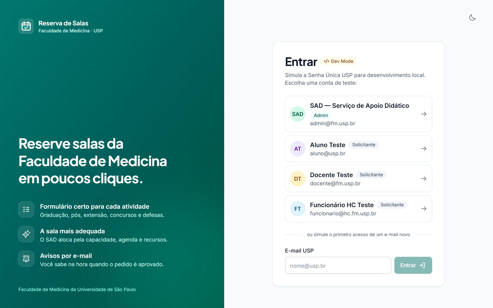 | 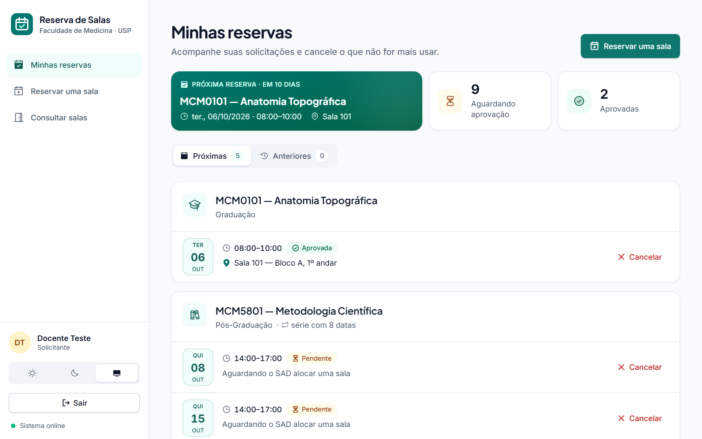 |
| **Login** (Dev Mode, simulando a Senha Única USP) | **Minhas reservas** — status de cada data e cancelamento |
| 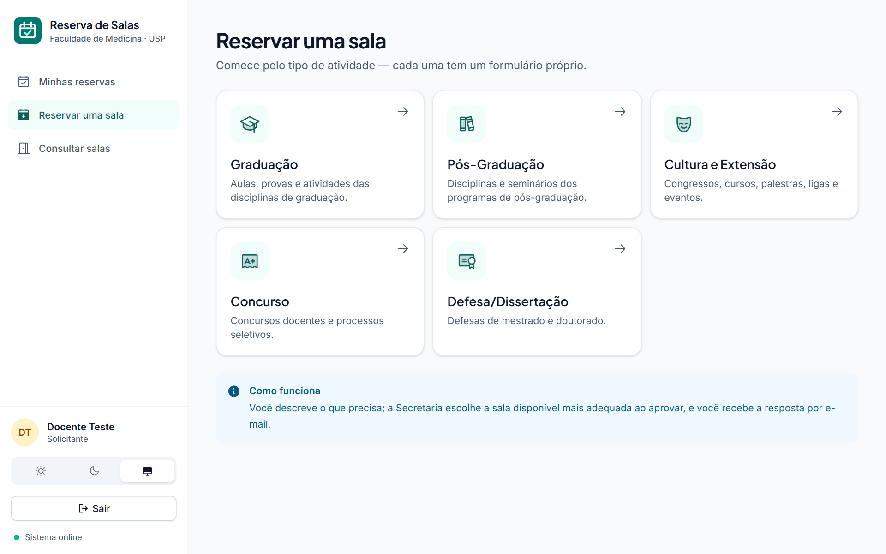 | 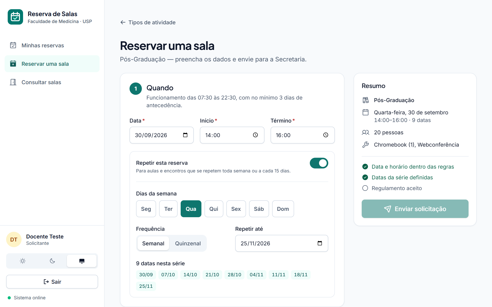 |
| **Reservar uma sala** — cada atividade tem seu formulário | **Formulário** — prévia das datas da série e checklist ao vivo |
| 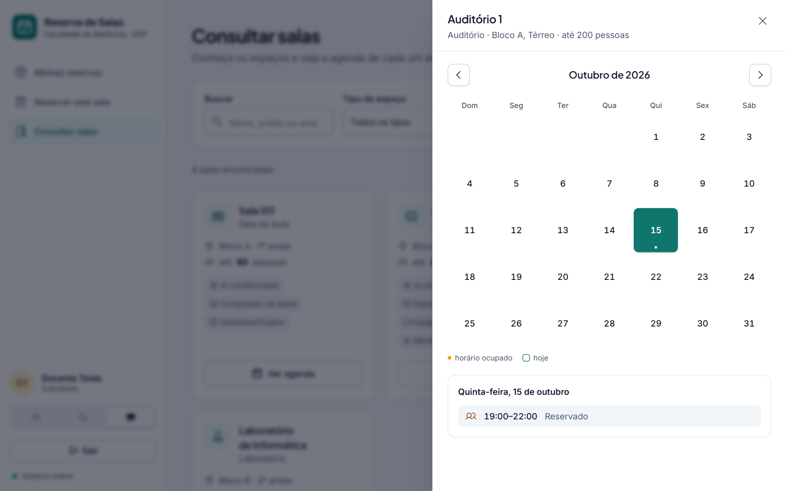 | 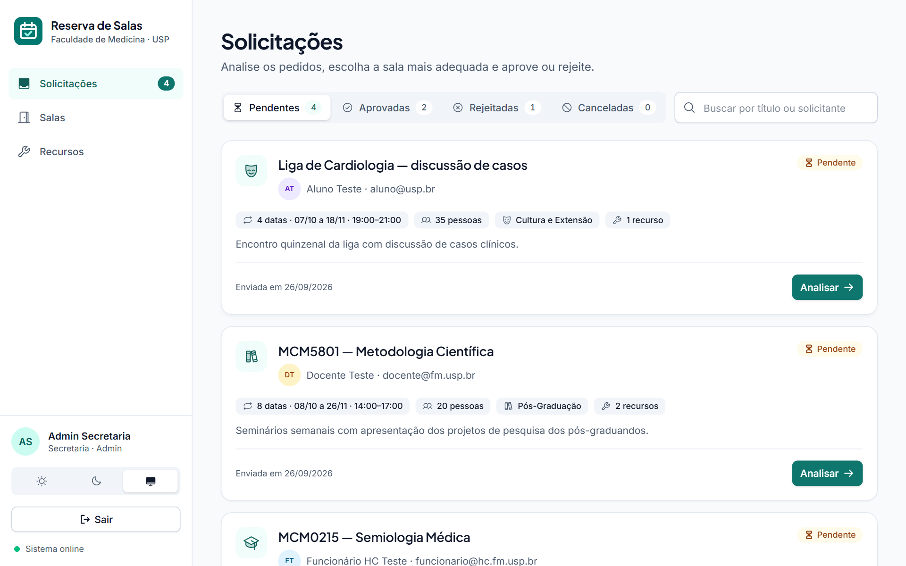 |
| **Consultar salas** — agenda com os horários de cada dia | **Solicitações** — fila do SAD, com filtros e busca |
| 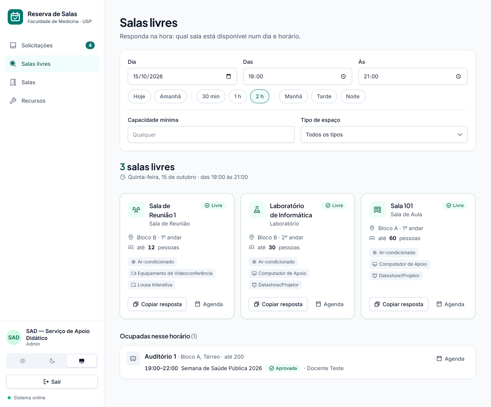 | 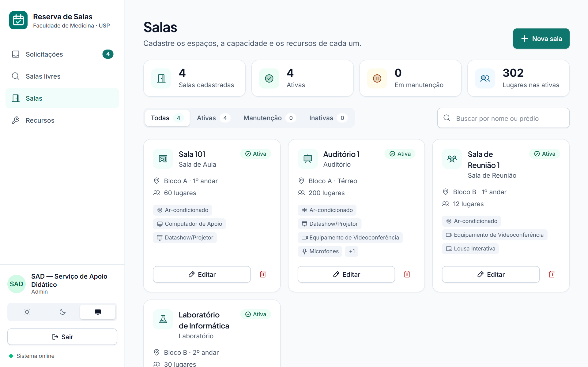 |
| **Salas livres** — "qual sala está livre dia 15, das 19 às 21?" | **Salas** — cadastro com capacidade, status e recursos |

<p align="center">
  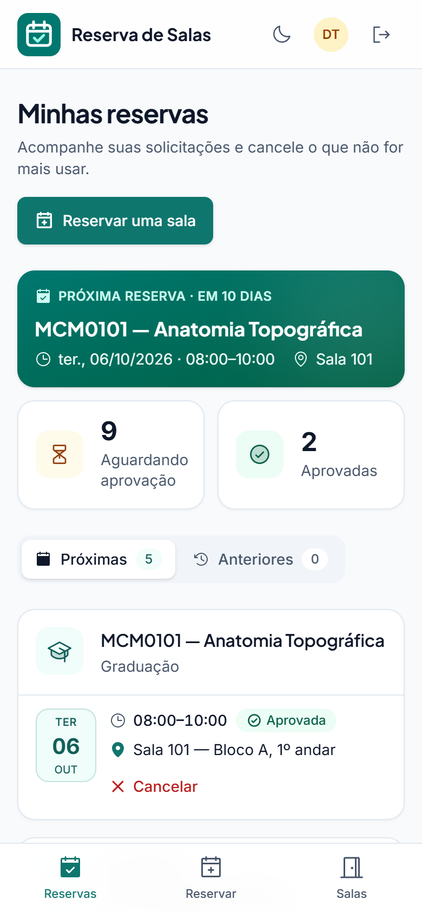
  &nbsp;&nbsp;
  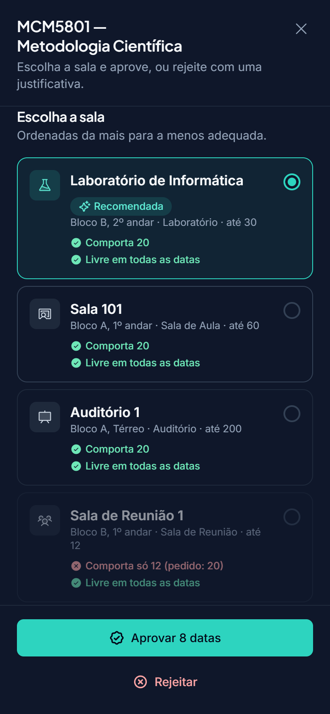
</p>
<p align="center"><em>No celular, com tema claro e escuro.</em></p>

<sub>Screenshots feitos com dados de demonstração.</sub>

## Estrutura

Monorepo simples com duas aplicações independentes:

```
sala-reservas-fmusp/
├── docker-compose.yml        # PostgreSQL 16 + Mailpit (SMTP de desenvolvimento)
├── render.yaml               # deploy da demonstração (Render + banco no Neon)
├── backend/                  # Node.js + Express + TypeScript + Prisma
│   ├── prisma/
│   │   ├── schema.prisma
│   │   ├── migrations/       # init + db_constraints (CHECKs e exclusão de sobreposição)
│   │   ├── seed.ts           # salas, recursos e usuários fictícios
│   │   └── import-fmusp.ts   # catálogo real da FMUSP (dados fora do git)
│   └── src/                  # app, config/env (zod), rotas, middleware de erros
└── frontend/                 # React + TypeScript + Vite + Tailwind v4
```

## Pré-requisitos
Node.js ≥ 20 e Docker (ou um PostgreSQL 14+ com a extensão `btree_gist` disponível).

## Primeiros passos

```bash
# 1. Banco e servidor SMTP de desenvolvimento
docker compose up -d

# 2. Back-end
cd backend
cp .env.example .env
npm install
npx prisma migrate dev      # aplica as duas migrations e gera o client
npm run db:seed             # recursos, salas e usuários fictícios
npm run db:import-fmusp     # opcional: salas reais e fotos (precisa de prisma/data/fmusp.json e FM/)
npm run dev                 # http://localhost:3333/api/health

# 3. Front-end (outro terminal)
cd frontend
cp .env.example .env
npm install
npm run dev                 # http://localhost:5173
```

A página inicial mostra o status da API e do banco — se ambos aparecerem como
`ok`/`up`, a Fase 1 está funcionando.

## Fase 2 — Autenticação

- Sessão via cookie httpOnly assinado (JWT com `SESSION_SECRET`), sem tabela de sessão.
- `AUTH_MODE=mock` (padrão em dev): tela "Dev Mode" lista os usuários do seed e
  permite logar em um clique, ou digitar um e-mail novo de domínio autorizado
  para simular o primeiro acesso. **Bloqueado automaticamente se `NODE_ENV=production`.**
- `AUTH_MODE=senhaunica`: fluxo OAuth 1.0a completo (`request_token` → tela de
  autorização da USP → `access_token` → dados do usuário), implementado em
  `backend/src/auth/senhaunica.ts` sem depender de biblioteca de terceiros
  (assinatura HMAC-SHA1 feita à mão em `oauth1.ts`, testada contra os vetores
  do RFC 5849).
  ⚠️ **O endpoint de dados do usuário (`SENHAUNICA_USER_INFO_PATH`) não pôde
  ser confirmado com uma fonte oficial** — os três primeiros passos seguem o
  padrão OAuth 1.0a documentado publicamente, mas esse último path é uma
  estimativa. Ajuste-o no `.env` (ou peça o valor certo à STI/USP) antes de
  testar com um consumidor real.
- `AUTH_MODE=oidc`: rota reservada, responde `501 Not Implemented` por enquanto.
- Domínio de e-mail e papel (`ADMIN_EMAILS`) são validados/atribuídos no
  primeiro login, nos três modos — reaproveitando a mesma regra do `CHECK`
  do banco.

## Fase 3 — CRUD administrativo de salas e recursos

- `GET /api/rooms` e `GET /api/resources`: qualquer usuário autenticado pode
  listar (necessário para a busca do solicitante na Fase 5).
- `POST`/`PATCH`/`DELETE` em `/api/rooms` e `/api/resources`: só Admin.
- Vínculo sala↔recurso (`room_resources`, com quantidade) é editado junto com
  a sala: o `PATCH` substitui todo o conjunto vinculado quando `resources` é enviado.
- Excluir uma sala com reservas/séries vinculadas é bloqueado pelo banco (FK
  `ON DELETE RESTRICT`) e devolve um erro amigável sugerindo marcar a sala como
  **Inativa** em vez de excluir.
- Front-end: painel do Admin com abas **Salas** e **Recursos**
  (`frontend/src/components/admin/`), visível só para `role = ADMIN`.
  Solicitantes veem um aviso de que a busca de salas chega na Fase 5.

## Fase 4 — Motor de reservas

Tudo em `backend/src/reservations/` + `POST /api/reservations`:

- **Regras** (`rules.ts`): horário de funcionamento (hoje 07h–22h, de segunda a
  sábado, fora feriados — ver [Portarias 2793 e 2794](#portarias-fmusp-nº-2793-e-27942026);
  calculado no fuso `APP_TIMEZONE` via `Intl.DateTimeFormat`), duração
  30 min–15 h, e antecedência mínima — implementada como **72 horas corridas**
  até o início do evento (não como "3 dias de calendário"; ajuste em
  `MIN_ADVANCE_MS` se a intenção for outra).
- **Recorrência** (`recurrence.ts`): usa a biblioteca `rrule` para expandir a
  regra RFC 5545 em ocorrências concretas, com um teto de 260 ocorrências e um
  horizonte padrão de 2 anos quando a série não tem `until`.
  ⚠️ Não tive como rodar `npm install`/testar essa integração de verdade neste
  ambiente (sem rede) — a lógica segue a API documentada da lib, mas vale
  conferir na prática assim que instalar as dependências.
- **Conflitos** (`conflicts.ts`): compara cada ocorrência com reservas
  `PENDING`/`APPROVED` e com `room_blocks` da mesma sala, usando a mesma
  semântica de intervalo `[início, fim)` da exclusion constraint do banco.
- **Concorrência**: a criação com sala definida roda em uma transação que
  primeiro trava a linha da sala (`SELECT ... FOR UPDATE`), só então checa
  conflito e grava — e ainda captura a violação da exclusion constraint como
  rede de segurança final, caso o banco pegue algo que a checagem em
  aplicação não pegou (o código de erro citado aqui antes, `P2004`, estava
  errado — ver Fase 6).
- **Solicitação parcial**: se alguma data da recorrência colidir, a API responde
  `409 RESERVATION_CONFLICT` com `{ conflictingDates, availableDates }` **sem
  criar nada**. O cliente reenvia o mesmo POST com `skipDates` contendo as
  datas conflitantes para criar só as livres (ou ajusta os horários e tenta de novo).
- Reserva **sem sala definida** (`roomId` omitido) pula checagem de conflito —
  fica para o Admin alocar e então aprovar (Fase 6).
- `GET /api/reservations` e `GET /api/reservations/:id`: só para eu conseguir
  testar a Fase 4 sem front-end ainda. O painel "Minhas Reservas" completo
  (com cancelamento) é a Fase 8; a tela de calendário/formulário é a Fase 5.

## Fase 5 — Calendário e formulário de solicitação (front-end)

- **Backend:** novo `GET /api/rooms/:id/availability?from=&to=` — lista os
  intervalos ocupados (reservas ativas + bloqueios) de uma sala num período.
  É só leitura para orientar a busca; não substitui a checagem de conflito
  feita dentro da transação em `POST /api/reservations`.
- **Busca de salas** (`frontend/src/components/solicitante/RoomSearch.tsx`):
  filtros por tipo, capacidade mínima e prédio; cada sala pode expandir um
  **calendário mensal simples** (`AvailabilityCalendar.tsx`) que pinta os dias
  com pelo menos um horário ocupado.
  ⚠️ Troquei o FullCalendar (sugerido lá na Fase 0) por uma grade de calendário
  feita à mão com React + Tailwind puro. Motivo: integrar o FullCalendar (+
  plugins timeGrid/RRule) é complexo o bastante para eu não conseguir validar
  sem rodar `npm install` e ver renderizar de verdade — e sem isso, o risco de
  entregar algo quebrado era alto. Se quiser mesmo o FullCalendar (visual mais
  rico, visão por hora), me avisa que eu troco numa iteração à parte.
- **Formulário de solicitação** (`ReservationForm.tsx`): todos os campos do
  espec — sala (ou "sem preferência"), data/horário, recorrência (dias da
  semana + semanal/quinzenal + até quando), título, descrição, nº de
  participantes, checklist de recursos, observações para TI, aceite do
  regulamento.
  - **Validação em tempo real** (`lib/reservationValidation.ts`) espelha as
    regras do back-end (horário, duração, antecedência, capacidade) só para
    feedback imediato — o servidor continua sendo a fonte da verdade.
  - Em caso de **conflito** (recorrência com alguma data ocupada), mostra as
    datas conflitantes e um botão para confirmar só as livres, usando o
    mecanismo `skipDates` da Fase 4.

## Correção pós-Fase 5 — solicitante não escolhe a sala

Ajuste de regra de negócio: o solicitante **não** seleciona uma sala específica.
Ele descreve a necessidade (participantes, recursos, finalidade) e a reserva
nasce com `roomId = null`; o Admin aloca a sala mais adequada ao aprovar (Fase 6).

- `POST /api/reservations` não aceita mais `roomId` nem `skipDates` — sempre
  cria com sala em branco. A checagem de conflito e o lock de linha
  (`src/reservations/conflicts.ts`) saíram da criação e ficam prontos para
  serem reaproveitados na Fase 6, quando o Admin escolhe a sala.
- Front-end: `ReservationForm` não tem mais campo de sala; `RoomSearch` virou
  um catálogo só de consulta (mostra tipos, capacidades, recursos e a agenda
  de cada sala), sem ação de "solicitar nesta sala".
- Validação de capacidade contra a sala saiu do formulário (não há sala ainda
  para comparar) — volta a fazer sentido no painel de aprovação da Fase 6.

## Fase 6 — Aprovação e alocação de salas (Admin)

Back-end em `backend/src/routes/admin.ts` (montado em `/api/admin`, só Admin);
front-end na nova aba **Solicitações** do painel do Admin
(`frontend/src/components/admin/RequestsAdmin.tsx` e `ReviewPanel.tsx`).

- `GET /api/admin/reservations?status=`: fila de solicitações com os dados do
  solicitante. O front agrupa as ocorrências de uma mesma série num card só.
- `GET /api/admin/reservations/:id/room-options?scope=`: avalia todas as salas
  **Ativas** e devolve já ordenadas da mais para a menos adequada
  (`src/reservations/allocation.ts`): comporta os participantes → livre em
  todas as datas → tem todos os recursos pedidos → menos datas em conflito →
  menor capacidade que comporta. É só leitura; a checagem que vale é a da aprovação.
- `POST /api/admin/reservations/:id/approve` `{ roomId, scope, skipConflicting? }`:
  aloca a sala e aprova numa transação só — trava a linha da sala
  (`SELECT … FOR UPDATE`), exige sala Ativa, valida capacidade
  (`CAPACITY_EXCEEDED`) e checa conflito com reservas ativas e bloqueios.
  Recurso faltando **não** bloqueia (o Admin pode providenciar um equipamento
  móvel); só aparece como aviso na tela.
  - Série com conflito parcial: `409 RESERVATION_CONFLICT` com
    `{ conflictingDates, availableDates }`, sem aprovar nada. Reenviando com
    `skipConflicting: true`, aprova as datas livres e deixa as ocupadas
    **pendentes**, para alocar em outra sala depois.
- `POST /api/admin/reservations/:id/reject` `{ reason, scope }`: justificativa
  obrigatória. Rejeitar libera o horário (a exclusion constraint só considera
  PENDING/APPROVED).
- **Escopo:** `single` age só na ocorrência da URL; `series` age em todas as
  ocorrências da série que ainda estão pendentes e não começaram.
- **Duas pessoas revisando ao mesmo tempo:** o `UPDATE` só altera linhas ainda
  `PENDING` e confere quantas mudou; se alguém revisou antes, a transação é
  desfeita e a API responde `409 RESERVATION_NOT_PENDING`.
- **Rede de segurança:** se a exclusion constraint do banco pegar uma
  sobreposição que a checagem em aplicação deixou passar, a API responde
  `409 RESERVATION_CONFLICT`.
  ⚠️ Correção do que a Fase 4 dizia: o Prisma 6 **não** devolve `P2004` nesse
  caso. A violação (SQLSTATE `23P01`) chega como
  `PrismaClientUnknownRequestError`, com o código só dentro da mensagem —
  conferido na prática contra o Postgres local (`isOverlapViolation` em
  `conflicts.ts`).
- `conflicts.ts` agora carrega a ocupação em 2 consultas (reservas + bloqueios
  da janela inteira) em vez de 2 por ocorrência, e aceita ids a ignorar: uma
  solicitação antiga que já nasceu com sala (de antes da correção pós-Fase 5)
  não conflita consigo mesma ao ser aprovada naquela sala. Na fila, essas
  aparecem com "Sala indicada".
- Aprovar e rejeitar avisam o solicitante por e-mail (ver Fase 7).

## Formulários por tipo de atividade

Ao clicar em **Reservar uma sala**, o solicitante escolhe primeiro a atividade
— Graduação, Pós-Graduação, Cultura e Extensão, Concurso ou Defesa/Dissertação
— e cada uma tem seus próprios campos em **Informações da reserva**. O
agendamento de datas e a lista de recursos (o catálogo cadastrado pelo Admin)
são iguais para todos os tipos.

- **Banco:** `reservations.activity_type` (enum) + `activity_details` (JSONB),
  na migration `activity_types`. Ficam nulos nas solicitações anteriores.
- **Validação por tipo** em `src/schemas/reservation.ts` (zod
  `discriminatedUnion` em `activityType`). Campos de outros tipos são
  descartados, assim como o que não se aplica: taxa de atividade gratuita,
  descrição de "Outros" quando outro tipo de reserva foi marcado.
- `src/reservations/activities.ts` converte cada formulário para as colunas
  comuns que a fila do Admin e a checagem de capacidade usam:
  - **título:** `código — disciplina` na Graduação/Pós,
    `Defesa de Doutorado — candidato` na Defesa, título informado nos demais;
  - **nº de pessoas:** nº de alunos, de participantes ou público previsto.
- **Front:** `ActivityFields.tsx` (campos de cada tipo) e `lib/activities.ts`
  (rótulos e linhas de detalhe no card do Admin). Trocar de tipo no meio do
  preenchimento não apaga o que já foi digitado.
- **Opções fixas:** "Tipo" da Graduação (Aula teórica, Aula prática, Prova,
  Reposição de aula, Outro), "Ano" (1º ao 6º) e "Nível" da Defesa (Mestrado,
  Mestrado Profissional, Doutorado).
- **Concurso:** "Público previsto" é o total de pessoas na sala e é o número
  usado na checagem de capacidade.
- ⚠️ **Código de disciplina:** por enquanto só o formato é conferido (3 letras
  + 4 números, ex.: `MCM0101`). Próximo passo: tabela de disciplinas no banco
  para validar de verdade — e transformar "Responsável pela disciplina" em
  select, como no sistema antigo.

### Recursos com quantidade e detalhe

O catálogo de recursos inclui os equipamentos do formulário antigo do
Anfiteatro: Chromebook, Webconferência, Bloqueio de internet para prova,
Equipamento pessoal e Outro equipamento, além dos que já existiam. O "Nenhum"
do formulário antigo não virou recurso: basta não marcar nada.

- Cada recurso pode **pedir quantidade** (`requests_quantity`, ex.: Computador,
  Chromebook) e/ou **pedir um detalhe** com texto de exemplo (`detail_prompt`,
  ex.: "Ex.: Zoom, Teams, Google Meet" na Webconferência). O Admin configura
  isso na aba **Recursos**.
- `reservations.requested_resources` passou de uma lista de ids para
  `[{ resourceId, quantity?, detail? }]`; a migration `resource_request_options`
  converte o que já existia. O back-end guarda quantidade e detalhe só nos
  recursos que pedem isso (`src/reservations/requested-resources.ts`).
- **Na escolha da sala** (Fase 6), a quantidade conta: uma sala com 1
  computador aparece como "Computador de Apoio: só 1 (pedido: 2)". Só pesam
  recursos que alguma sala tem cadastrado; os demais (Chromebook,
  Webconferência, Equipamento pessoal…) são itens avulsos que a TI
  providencia e não dependem da sala.
- Recurso com **opções fixas** (`detail_options`) mostra um select em vez de
  texto livre, e a escolha é obrigatória: é o caso do "Bloqueio de internet
  para prova", em que se escolhe a plataforma liberada (Canvas, e-Disciplinas
  ou TestPortal).

### Testar a API pelo terminal

`reserva.json` (aula avulsa de Graduação) e `recorrente.json` (disciplina de
Pós, toda quinta) são exemplos prontos para enviar com `curl.exe`. No
PowerShell:

```powershell
# login (Dev Mode) — guarda o cookie de sessão em cookies.txt
'{"email":"aluno@usp.br"}' | curl.exe -c cookies.txt -H "Content-Type: application/json" --data-binary "@-" http://localhost:3333/api/auth/mock/login

curl.exe -b cookies.txt -H "Content-Type: application/json" --data-binary "@reserva.json" http://localhost:3333/api/reservations
curl.exe -b cookies.txt -H "Content-Type: application/json" --data-binary "@recorrente.json" http://localhost:3333/api/reservations
```

Os `resourceId` dos exemplos são do banco local em que foram escritos. Em
outro banco, pegue os seus em `GET /api/resources`.

### Mostrar o app rodando localmente (sem deploy)

Com o back-end e o front no ar, um túnel temporário da Cloudflare gera um link
público `https://….trycloudflare.com` que aponta para o seu computador. Não
precisa de conta, e o link dura enquanto o comando estiver rodando:

```powershell
cloudflared tunnel --url http://localhost:5173
```

O `vite.config.ts` libera só os domínios de túnel (`.trycloudflare.com` e
`.devtunnels.ms`, do VS Code); qualquer outro host continua bloqueado. Quem
tiver o link usa o Dev Mode e os dados do banco local, inclusive como Admin.

### Demonstração online (Render + Neon)

Para deixar o sistema no ar sem depender do computador ligado:

- **Render**, plano grátis: um serviço web só. O Express serve a API e também
  o front-end compilado (`frontend/dist`), com fallback para as rotas do
  React. Tudo fica na mesma origem, então o cookie de sessão funciona sem
  CORS. A configuração está em `render.yaml`.
- **Neon**, plano grátis: o PostgreSQL, com a extensão `btree_gist`. As fotos
  ficam no banco, então o servidor não precisa de disco.

O modo demonstração é ligado por variáveis de ambiente:

| Variável | Na demonstração | Para quê |
|---|---|---|
| `ACCESS_CODE` | código combinado | Antes de qualquer tela, o site pede esse código. Sem ele, a API responde `ACCESS_CODE_REQUIRED` (só `/api/health` e `/api/access` ficam abertos). O cookie guarda um HMAC do código, e trocar o código derruba os acessos antigos. São 10 tentativas erradas por IP a cada 15 min. |
| `DEMO_MODE` | `true` | Libera o login de teste (`AUTH_MODE=mock`) em produção, desde que `ACCESS_CODE` esteja definido. Sem essa combinação, o servidor não sobe. |
| `BREVO_API_KEY` | chave do Brevo | Envia os e-mails pela API HTTP do Brevo (grátis, 300/dia), e não por SMTP, que hospedagens grátis costumam bloquear. O remetente de `MAIL_FROM` precisa estar verificado no Brevo. |
| `MAIL_REDIRECT_TO` | seu e-mail | Todo e-mail da demonstração vai para este endereço, com o destinatário original no assunto, porque as contas de teste (`aluno@usp.br`…) podem ser caixas reais da USP. Com `DEMO_MODE` e sem esta variável, elas não recebem nada. |
| `MAIL_REDIRECT_EXCEPT` | e-mail da TI | Endereços que recebem direto, sem redirecionar (ex.: o e-mail real da TI, também em `TI_EMAIL_ADDRESS`). |
| `FRONTEND_URL` | (vazio) | Vem sozinho de `RENDER_EXTERNAL_URL`. |

Para conferir a configuração de e-mail, use `POST /api/admin/test-email {"to": "..."}` (só o SAD). Ele envia na hora e devolve o erro do Brevo, se houver.

**Passo a passo:**

1. No Neon, crie um projeto na região **AWS US East (N. Virginia)**, a mesma
   do serviço no Render. Copie a connection string.
2. Carregue o banco do seu computador. Os dados reais e as fotos saem daqui,
   e não do GitHub. Em `backend/`, crie `.env.neon` (fora do git) com
   `DATABASE_URL=<connection string>` e rode:

   ```bash
   export $(grep DATABASE_URL .env.neon)   # no PowerShell: $env:DATABASE_URL="..."
   npx prisma migrate deploy
   npm run db:seed          # recursos e contas de teste
   npm run db:import-fmusp  # salas reais, inventário, notebooks e fotos
   ```
3. No Render, crie um **Blueprint** a partir deste repositório. Ele lê o
   `render.yaml` e pede `DATABASE_URL` (a mesma do Neon) e `ACCESS_CODE`.
4. Abra o endereço `https://….onrender.com` e digite o código.

No plano grátis, o serviço "dorme" depois de 15 minutos sem acesso, e o
primeiro acesso depois disso leva cerca de 1 minuto. Antes de apresentar, abra
o site um pouco antes.

## Fase 8 — Minhas Reservas

A aba **Minhas reservas** passou a ser a tela inicial do solicitante
(`frontend/src/components/solicitante/MyReservations.tsx`).

- Lista as próprias solicitações em **Próximas** e **Anteriores**. As datas de
  uma série ficam num card só, e cada data mostra o próprio status: sala
  alocada (aprovada), "aguardando alocação" (pendente), justificativa
  (rejeitada) ou data do cancelamento.
- `POST /api/reservations/:id/cancel` `{ scope }`: o solicitante cancela uma
  data (`single`) ou todas as próximas datas ativas da série (`series`).
  - A reserva **aprovada** é cancelada pelo sistema até **3 dias úteis antes**
    da data (Portaria 2793, Art. 9º; `CANCEL_DEADLINE_PASSED` depois disso —
    aí só o SAD cancela). O pedido ainda **pendente** pode ser retirado até o
    horário começar. Numa série, as datas aprovadas fora do prazo continuam de
    pé (`keptIds` na resposta).
  - Só o dono pode cancelar: para outras pessoas, a API responde 404, sem
    revelar que a reserva existe.
  - Cancelar **libera o horário da sala** na hora: a exclusion constraint só
    considera PENDING/APPROVED.
- Na fila do Admin, a aba **Canceladas** mostra quando o solicitante cancelou.
- Cancelar avisa o SAD por e-mail (ver Fase 7).

## Alterar uma reserva (solicitante)

- Em **Minhas reservas**, cada reserva pendente ou aprovada tem o botão
  **Alterar** até **3 dias úteis antes** da data (o mesmo prazo do
  cancelamento, Portaria 2793, Art. 9º). Ele abre o mesmo formulário, já
  preenchido (`/minhas-reservas/:id/editar`).
- `PUT /api/reservations/:id` recebe os campos do formulário mais `{ scope }`:
  - `single` altera só aquela data;
  - `series` altera esta e as próximas datas da série, com a mesma mudança de
    data e horário em todas.

  Valem as regras da criação (horário de funcionamento, antecedência), mais:
  - o tipo de atividade não muda (`ACTIVITY_TYPE_LOCKED`), nem a recorrência;
  - depois do prazo de 3 dias úteis, a API recusa com `EDIT_TOO_SOON`.
- A reserva volta para **Pendente**, marcada como alterada
  (`modified_by_requester_at`), e a sala é liberada. `previous_snapshot` guarda
  como ela estava na última análise do SAD: status, horário, sala e
  participantes.
- O SAD vê as alteradas na aba **Alteradas** de Solicitações, e não em
  Pendentes. O painel de análise mostra um quadro "antes × agora" e já deixa
  marcada a sala anterior, se ela ainda servir.
- E-mails:
  - confirmação ao solicitante;
  - aviso ao SAD;
  - aviso à TI, se a reserva estava aprovada e tinha recursos pedidos.

## O SAD reserva, altera e cancela qualquer reserva

- **Reservar** (`POST /api/admin/reservations`, tela `/admin/reservar`): a
  reserva feita pelo SAD **não passa pela fila**. Ela já nasce aprovada, na
  sala escolhida.
  - É o mesmo formulário, com a sala obrigatória e a repetição semanal ou
    quinzenal.
  - Não precisa dos 3 dias de antecedência.
  - A sala é travada, e o sistema confere o horário de funcionamento, a
    capacidade e o conflito em **todas** as datas. Se alguma estiver ocupada,
    a API responde `RESERVATION_CONFLICT` com as datas e nada é gravado.
  - Atalhos que abrem o formulário já preenchido:
    - "Nova reserva" em Solicitações e na Agenda (com o dia);
    - o "+" de cada sala na linha do tempo da Agenda (sala e dia);
    - "Reservar" em cada sala livre de **Salas livres** (sala, dia e horário
      pesquisados).
  - A TI é avisada se houver recursos ou observações. O próprio SAD não
    recebe "reserva aprovada".
- Em **Solicitações**, na **Agenda** e no painel de uma reserva, o SAD tem
  **Alterar** e **Cancelar** para toda reserva pendente ou aprovada que ainda
  não terminou.
- **Alterar** (`PUT /api/admin/reservations/:id`, tela
  `/admin/reservas/:id/editar`): o mesmo formulário do solicitante, sem as
  travas dele.
  - Não precisa dos 3 dias de antecedência, só de um horário que ainda não
    passou.
  - Pode trocar o tipo de atividade e, numa reserva aprovada, a sala.
  - **Não volta para análise**: a aprovada continua aprovada. Por isso vale a
    mesma checagem de conflito e de capacidade da aprovação, com a sala
    travada (`SELECT … FOR UPDATE`). Se a sala estiver ocupada, a API responde
    `RESERVATION_CONFLICT`.
  - Numa série, dá para alterar só a data ou esta e as próximas.
  - Grava `modified_by_admin_at`. O solicitante recebe um e-mail com o "antes"
    e o novo horário; a TI também, se a reserva estava aprovada com recursos.
- **Cancelar** (`POST /api/admin/reservations/:id/cancel`) exige o **motivo**,
  que vai para o solicitante por e-mail e aparece em Minhas reservas
  ("Cancelada pelo SAD: …"). O horário fica livre na hora.
  - `cancelled_by_id` registra quem cancelou: o solicitante ou o SAD.

## Agenda (SAD)

Tela `/admin/agenda`: tudo o que acontece num dia.

- **Dia a dia**: setas, "Hoje", escolha da data e um calendário do mês com a
  quantidade de reservas ativas em cada dia (em destaque os dias com
  pendências).
- **Reservas do dia**, filtradas por situação: pendentes, alteradas,
  aprovadas, canceladas e rejeitadas. Cada uma abre o painel com todos os
  dados, mais Analisar, Alterar e Cancelar.
- **Salas no dia**: linha do tempo de 07h a 22h (estendida quando há reserva
  em horário extraordinário) com cada sala ativa. Mostra as
  reservas aprovadas, as pendentes com sala e os bloqueios, e separa as salas
  ocupadas das livres o dia todo.
- A data e a reserva aberta ficam na URL (`?data=2026-10-15&reserva=…`).
- API (só o SAD): `GET /api/admin/agenda?date=AAAA-MM-DD` (o dia no fuso
  `APP_TIMEZONE`) e `GET /api/admin/agenda/month?month=AAAA-MM` (contagem por
  dia e situação).

A **agenda de cada sala** (Consultar salas → Ver sala e agenda, e Salas
livres) agora mostra a reserva inteira do dia escolhido:
- todos veem o título e o tipo de atividade (Graduação, Cultura e Extensão…);
- o SAD vê também o solicitante, os participantes, os recursos, as
  observações e a descrição, com um atalho para a Agenda.

## Regulamento (portarias)

- O "Li e concordo" do formulário de reserva abre o **regulamento**, com o
  texto e os PDFs das portarias. O botão "Li e concordo" do diálogo já marca o
  aceite.
- O SAD edita tudo em **Regulamento** (`/admin/regulamento`), sem depender de
  deploy:
  - o texto aceita parágrafos, títulos com `## `, listas com `- ` e
    `**negrito**`;
  - os PDFs das portarias são anexados ali mesmo e ficam guardados no banco.
- O solicitante lê o regulamento em `/regulamento`.
- API: `GET /api/regulamento`; só para o SAD, `PUT /api/regulamento`,
  `POST /api/regulamento/files?nome=…` (o corpo é o PDF) e
  `DELETE /api/regulamento/files/:id`. O PDF abre em
  `GET /api/regulamento/files/:id`.

O formulário de reserva começa **em branco**: sem data, sem horário e sem
nenhuma opção pré-marcada. O aviso de horário só aparece depois que data,
início e término são preenchidos.

## Portarias FMUSP nº 2793 e 2794/2026

As duas portarias de 02/06/2026 — **2793** (uso dos espaços) e **2794**
(valores de referência) — são as regras do sistema. O texto integral está no
Regulamento (migration `20260929000000_portarias_2793_2794`, que só substitui o
texto se o SAD ainda não o tiver editado pela tela). Onde cada regra está:

| Regra | Como o sistema aplica |
| --- | --- |
| **Horário** (Art. 6º): dias úteis e sábados, 07h–22h | O solicitante não pede em domingo, feriado/ponto facultativo nem fora das 07h–22h. Numa série, os feriados ficam de fora (`skippedDates`). Feriados em `lib/calendar.ts` (nacionais, 9 de julho, 25 de janeiro, Carnaval, Sexta-feira Santa e Corpus Christi); pontos facultativos decretados a cada ano não entram. |
| Horário extraordinário (Art. 6º §1º) | Só o SAD reserva, marcando a autorização prévia da Divisão Acadêmica e o custeio da equipe de apoio (`extraordinaryAuthorized`). A reserva fica com `outside_regular_hours`, que libera o CHECK de horário do banco. |
| **Protocolo** (Art. 8º §1º, b) | Todo pedido recebe um nº (`000123/2026`, sequência `reservation_protocol_seq`); as datas de uma série compartilham o número. Aparece na confirmação, em Minhas reservas, na fila e na Agenda do SAD e em todos os e-mails; a busca da fila aceita o protocolo. |
| Informações inexatas (Art. 8º, parágrafo único) | Aviso junto ao aceite do formulário. |
| **Cancelamento** (Art. 9º): 3 dias úteis antes | Ver [Fase 8](#fase-8--minhas-reservas) e [Alterar](#alterar-uma-reserva-solicitante). Minhas reservas mostra até quando dá para cancelar. |
| **Ausências** (Art. 9º §2º): 3 em 12 meses | O SAD registra "Não compareceu" (`POST/DELETE /api/admin/reservations/:id/no-show`) em reserva aprovada que já começou. O painel do pedido mostra as ausências do solicitante e avisa a recorrência. |
| **Sanções** (Art. 9º §2º, 11, 17, 22) | Advertência, multa ou suspensão de novas reservas — até 1 ano ou "até a regularização" (inadimplência), podendo cancelar as reservas futuras (`POST /api/admin/users/:id/sanctions`, `POST /api/admin/sanctions/:id/lift`). Suspenso não pede nem altera (`USER_SUSPENDED`). Lista das suspensões em vigor em Solicitações. |
| **Chaves** (Art. 10) | Confirmação, Minhas reservas ("retire as chaves às …") e e-mail de aprovação: comparecer ao SAD/NE 10 minutos antes. |
| **Realocação** (Art. 12) | Trocar a sala de uma reserva aprovada exige marcar a autorização da Divisão Acadêmica e da Diretoria (`RELOCATION_NEEDS_AUTHORIZATION`). |
| **Cadeiras sobressalentes** (Art. 5º §2º) | Capacidade = cadeiras da sala; as "cadeiras extras" deixam de aparecer para o solicitante e o formulário avisa. |
| **Prioridades** (Art. 7º) | Cada pedido mostra a prioridade (1ª graduação … 8ª outras) na fila e no painel do SAD. Novo tipo **Reunião / Administrativo** (reuniões administrativas, Diretoria, Representação dos Funcionários). |
| **Montagem** (Art. 19) | Campo "Montagem" (até 4 h): o período reservado começa antes da atividade (`setup_minutes`); entra no conflito, na taxa e no aviso à TI. |
| **CCEx** (Art. 20–21) | Cultura e Extensão pede programação, público-alvo, entidade organizadora (Art. 4º; externas precisam de autorização da Divisão Acadêmica), contato do responsável, patrocínio e a situação na CCEx. Para aprovar (ou o SAD reservar), o SAD confirma autorização da CCEx, aprovação da Divisão Acadêmica e taxa paga/isenção (`approval_checklist`). |
| **Taxas e isenções** (2793 Arts. 13–16; 2794 Arts. 2º–4º) | Estimativa em `frontend/src/lib/fees.ts`: Teatro R$ 625/h, anfiteatros R$ 375/h, salas R$ 125/h, mínimo de 2 h + 1 h antes e 1 h depois; áreas de apoio; 25% de desconto (Sistema FMUSP/HC, USP, SES, Adolfo Lutz); isenções e "pode ser isenta"; pagamento à FFM 30 dias antes. Os valores são reajustados todo ano pelo IPC-FIPE — atualize as constantes. |
| **Coffee break** (2794 Art. 5º) | Pedido marca "coffee break"; salas de aula só 2366/2368, 2223 e 1357 (+20% na estimativa). As outras aparecem bloqueadas na aprovação (`COFFEE_BREAK_NOT_ALLOWED`). |
| **Bebidas alcoólicas** (Art. 23) | Compromisso obrigatório no formulário (`no_alcohol_commitment`), inclusive na reserva feita pelo SAD. |
| Equipe de áudio e vídeo (Art. 18) | Aviso no formulário para sábados, domingos e feriados (mínimo de 2 técnicos, pagos à FFM). |

## Catálogo real de salas e inventário

As salas da faculdade vêm das planilhas do SAD: cadeiras, dimensões e os
equipamentos de cada sala, com modelo e patrimônio.

- `npm run db:import-fmusp` (em `backend/`) carrega esses dados de
  `backend/prisma/data/fmusp.json`.
  - O arquivo **não fica no git**, porque os números de patrimônio são dados
    internos. Sem ele, o projeto roda com as salas fictícias do seed.
  - O import pode rodar de novo. Ele identifica a sala por prédio, andar e
    nome, substitui o inventário pelo da planilha e mantém o status que o SAD
    deu a ela.
  - As salas fictícias do seed saem do banco se nada aponta para elas. Se já
    têm reservas de teste, ficam **Inativas**.
- Cada sala tem:
  - capacidade (cadeiras da plateia), cadeiras extras e dimensões;
  - tipo: Anfiteatro, Sala de Aula, Sala de Informática, Sala de Reunião,
    Congregação/CTA ou Teatro;
  - tipo de cadeira (Escolar, Universitária fixa, Universitária móvel; pode
    ter mais de um), porta de 900 mm e **atendimento especial**. Essas
    informações aparecem para o solicitante, e a consulta de salas filtra as
    salas com atendimento especial.
- **Capacidade "a definir"**: uma sala fora de uso (em reforma, por exemplo)
  pode ficar sem capacidade. Sala **Ativa** precisa dela, porque entra na
  alocação. A API recusa com `CAPACITY_REQUIRED`, e o banco garante a mesma
  regra (`rooms_active_capacity_check`).
- Cada recurso da sala tem quantidade, modelo e patrimônio(s). O que não é um
  tipo de recurso vai em **Outros equipamentos**, em texto livre.
- **Só o SAD vê modelo, patrimônio e outros equipamentos.** Para os demais
  perfis, `GET /api/rooms` e `GET /api/rooms/:id` omitem esses campos.
- Recursos com `requestable = false` (nobreak, monitor, splitter…) ficam só no
  inventário:
  - não aparecem no formulário de reserva nem na consulta de salas;
  - a API recusa um pedido deles com `RESOURCE_NOT_REQUESTABLE`.
- Tela **Recursos**, aba **Inventário** (`/admin/recursos?aba=inventario`):
  - busca por patrimônio, modelo ou sala, com o termo destacado;
  - filtros por recurso e por prédio;
  - **Exportar CSV**, que abre direto no Excel;
  - **Editar**, que abre o painel da sala.
- Tela **Recursos**, aba **Notebooks** (`/admin/recursos?aba=notebooks`):
  controle de patrimônio dos notebooks do SAD, que não são reservados pelo
  sistema.
  - Dois grupos: **Backup no SAD** e **Transferidos para o NIT** (a TI da
    faculdade).
  - Cadastrar, informar o modelo, mover de um grupo para o outro, excluir e
    exportar CSV.
  - API `/api/notebooks`, só para o SAD. O import carrega os patrimônios da
    planilha e não mexe no que o SAD já editou.

## Fotos das salas

- Onde aparecem:
  - **Consultar salas**: cada card tem a foto de capa, que abre a galeria.
    **Ver sala e agenda** mostra um mosaico de fotos, a capacidade, as
    cadeiras extras, as dimensões, os recursos e a agenda.
  - **Formulário de reserva**: o bloco **Conheça as salas** mostra, com fotos,
    as salas que comportam o número de pessoas informado, da menor para a
    maior. Serve só para o solicitante ter uma ideia; quem define a sala
    continua sendo o SAD.
  - **Minhas reservas**: a sala de uma reserva aprovada tem o botão
    "N fotos".
  - Telas do SAD: miniatura da sala em Salas livres, na escolha da sala ao
    analisar um pedido e no inventário.
- **Galeria em tela cheia**: setas da tela ou do teclado, miniaturas e deslizar
  no celular. O Esc fecha só a galeria, mesmo com um painel aberto por baixo.
- API (só Admin):
  - `POST /api/rooms/:id/photos`: o corpo é o próprio arquivo
    (`Content-Type` `image/jpeg`, `image/png` ou `image/webp`, até 30 MB), com
    legenda opcional em `?caption=`;
  - `PATCH /api/rooms/:id/photos/:photoId` altera a legenda;
  - `PUT /api/rooms/:id/photos/order` define a nova ordem (a primeira é a
    capa);
  - `DELETE /api/rooms/:id/photos/:photoId` remove a foto e os arquivos.
- **Arquivos**: o back-end (sharp) gera duas versões WebP de cada foto,
  `thumb` (720 px) e `large` (1920 px), respeita a orientação do EXIF e
  descarta a original. As fotos originais (cerca de 700 MB) viraram 19 MB.
  - As versões ficam **no próprio banco** (`room_photos.thumb` e `.large`), e
    não em disco. Assim o app roda em hospedagem sem disco persistente, e o
    import manda as fotos direto para o banco. As listagens nunca carregam
    esses bytes.
  - São servidas em `/api/fotos/<id>-thumb.webp` e `-large.webp`, só para
    quem está logado.
  - Foto nova ganha um id novo, então o navegador pode guardá-las em cache
    para sempre (`immutable`).
- No painel da sala (**Salas → Editar**), o SAD adiciona várias fotos de uma
  vez, escolhe a capa, edita a legenda e remove fotos. Essas ações valem na
  hora, sem depender do "Salvar alterações".
- `npm run db:import-fmusp` também importa as fotos da pasta `FM/` (fora do
  git):
  - a legenda vem do nome do arquivo (`1104_PROJETOR_LONGE.JPG` →
    "Projetor (de longe)");
  - a foto das cadeiras vira a capa;
  - rodar de novo não duplica as fotos.

## Salas livres (SAD)

Consulta rápida para o SAD responder na hora "qual sala está livre no dia 30,
das 10 às 11?".

- `GET /api/admin/availability?start=&end=` (só Admin): cada sala ativa, livre
  ou ocupada no intervalo. Se estiver ocupada, diz por quê: reserva pendente ou
  aprovada, com título e solicitante, ou bloqueio. Um evento pode começar
  exatamente quando outro termina.
- Tela `/admin/salas-livres`:
  - dia e horário com atalhos (hoje, amanhã, 30 min / 1 h / 2 h,
    manhã / tarde / noite) e filtros de capacidade e tipo;
  - resultado atualizado enquanto se digita;
  - **Copiar resposta**, com uma frase pronta para mandar a quem perguntou;
  - agenda da sala aberta já no dia pesquisado.

  A pesquisa fica na URL, então dá para voltar a ela ou compartilhar o link.

## Fase 7 — Avisos por e-mail

Nodemailer em `backend/src/mail/`. Em dev, os e-mails vão para o **Mailpit**
do `docker-compose` e aparecem em http://localhost:8025 — nada sai de verdade.

| Quando | Para quem | O quê |
|---|---|---|
| Solicitação enviada | solicitante | confirmação, com as datas |
| Solicitação enviada | SAD (todos os Admins) | nova solicitação para analisar |
| Aprovada | solicitante | sala e datas (e quantas datas da série seguem em análise) |
| Aprovada, com recursos pedidos | TI (`TI_EMAIL_ADDRESS`) | o que preparar, onde e quando |
| Rejeitada | solicitante | justificativa |
| Cancelada pelo solicitante | SAD | horário liberado |
| Cancelada, e já estava aprovada com recursos | TI | recursos dispensados |
| Alterada pelo solicitante | solicitante | confirmação, com o novo horário |
| Alterada pelo solicitante | SAD | como estava e como ficou, para nova análise |
| Alterada, e já estava aprovada com recursos | TI | aguardar a nova aprovação |
| Alterada pelo SAD | solicitante | como estava e como ficou (continua aprovada/pendente) |
| Alterada pelo SAD, aprovada com recursos ou observações | TI | novas datas, sala e o que preparar |
| Cancelada pelo SAD | solicitante | o motivo |
| Cancelada pelo SAD, e estava aprovada com recursos | TI | recursos dispensados |

Na aprovação, a TI recebe o e-mail quando a reserva pede recursos **ou**
quando tem observações para a TI/infraestrutura, mesmo sem recursos.

- **Um e-mail por ação, não por data:** aprovar uma série de 10 datas gera um
  e-mail com as 10 datas.
- Datas formatadas no fuso `APP_TIMEZONE`, não no do servidor.
- Cada e-mail tem versão em texto e em HTML, geradas do mesmo conteúdo
  (`layout.ts`). O que o usuário digita (título, justificativa, observações) é
  escapado no HTML.
- **Envio fora da transação e sem bloquear a resposta** (`sendInBackground`):
  a reserva já foi gravada, então uma falha de SMTP só vai para o log, sem
  virar erro para quem clicou. Em produção, o próximo passo seria uma tabela de
  *outbox* com novas tentativas.

## Interface

Redesign completo do front-end, responsivo do celular ao computador, com tema
claro e escuro.

- **Tokens de cor semânticos** em `frontend/src/index.css` (`bg-surface`,
  `text-muted`, `bg-primary`…): o tema escuro troca os valores num lugar só,
  sem `dark:` espalhado pelos componentes. Os pares de texto e fundo têm
  contraste de pelo menos 4,5:1 nos dois temas. O tema pode ser claro, escuro
  ou seguir o sistema, e é aplicado antes de o React montar (sem "piscar").
- **Componentes próprios** em `components/ui/`: botão, campos com rótulo,
  dica e erro, selos, cards, controle segmentado, avatar e o diálogo/painel
  lateral sobre o `<dialog>` nativo (Esc fecha, o foco fica preso, o fundo
  fica inerte).
- **Navegação com URL por tela** (react-router 7): `/minhas-reservas`,
  `/reservar`, `/salas`, `/regulamento`; `/admin/solicitacoes`, `/admin/agenda`,
  `/admin/salas-livres`, `/admin/salas`, `/admin/recursos`, `/admin/regulamento`. Barra lateral a partir de 1024 px, barra inferior no
  celular. O Admin vê na navegação quantas solicitações estão pendentes.
  ⚠️ Em produção, o servidor estático precisa devolver o `index.html` para
  qualquer caminho desconhecido (fallback de SPA).
- **Interações:**
  - toasts para o resultado das ações;
  - diálogo de confirmação próprio no lugar do `window.confirm`;
  - painel lateral de análise com a sala "Recomendada";
  - escolha da atividade em cards;
  - prévia das datas de uma série e checklist do que falta, no formulário;
  - recursos em cards com ícone e quantidade;
  - calendário que mostra os horários ocupados do dia clicado;
  - esqueletos de carregamento.
- **Acessibilidade:**
  - foco sempre visível e alvos de toque de 44 px;
  - rótulos em todos os campos e ícones decorativos escondidos dos leitores
    de tela;
  - toasts anunciados via `aria-live`;
  - foco levado ao conteúdo a cada troca de página;
  - respeito ao "reduzir movimento" do sistema.
- **Ícones:** Phosphor. **Fontes:** Inter e Plus Jakarta Sans, servidas pelo
  próprio app (Fontsource), sem chamadas a serviços externos.

## Decisões de modelagem (Fase 1)

- **Reservas recorrentes** ficam em `reservation_series` (regra RRule) e cada
  ocorrência vira uma linha em `reservations`. Assim conflito, aprovação e
  cancelamento funcionam data a data.
- **Sobreposição** é barrada em duas camadas: transação com `SELECT … FOR UPDATE`
  na sala (Fase 4) e *exclusion constraint* no PostgreSQL (`btree_gist`).
- **Horário, duração, aceite de termos e domínio de e-mail** também têm `CHECK`
  no banco (migration `db_constraints`), além da validação amigável no back-end.
- `reservations.room_id` é **opcional**: sem sala preferencial, nada é
  pré-bloqueado, e o Admin só consegue aprovar depois de alocar uma sala.
- Prisma fixado na série **6.x** (schema clássico com `url = env(...)`).
